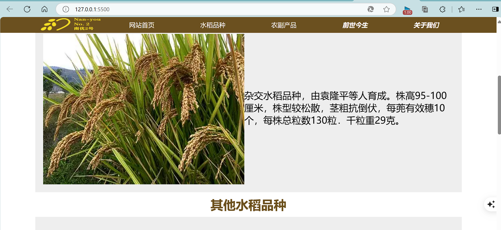

# 默认显示效果
默认"登录|注册 购物车"那一行随着页面滚动不会消失，是fixed的状态

## 可以转换为如下效果：
没滚动：

滚动了：

> 方法：
1.用vacode的liveServe打开运行项目（因为①浏览器对从本地文件系统（file:// 协议）加载的页面施加的额外限制主要是出于安全考虑，以防止恶意本地文件访问用户的敏感数据或执行不安全的操作。②用这个插件打开项目会热刷新界面，达到跨源框架访问的效果）
2.打开"./js/global.js"把11行、12行、13行、27行、38行注释掉即可恢复原本默认效果

# 感谢阅读！
